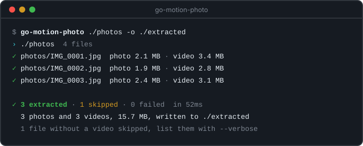

<div align="center">


# Go Motion Photo

A command-line tool and Go library for handling **Samsung Motion Photos**.<br>
Extract video and image components from motion photo files (`.jpg`, `.jpeg`, `.heic`).

[](https://github.com/ikerls/motion-photo-extractor/releases)
[](https://github.com/ikerls/motion-photo-extractor/actions/workflows/release.yml)
[](https://pkg.go.dev/github.com/ikerls/motion-photo-extractor)
[](go.mod)
[](LICENSE)

[Features](#features) ·
[Options](#options) ·
[Configuration](#configuration) ·
[Usage Examples](#usage-examples) ·
[Installation](#installation) ·
[Library](#library)



</div>

## Features

- Process Samsung Motion Photos (both legacy and current formats)
- Process several files, whole directories, glob or regular expression patterns
- Configurable output options
- Supports JPG and HEIC motion photo formats
- Readable terminal output with a progress bar and a summary, structured text or JSON logs when redirected
- Usable as a dependency-free Go library

## Options

### Input Options

`<path>...` / `-i`, `--input <path>`: Motion photo files, directories or patterns. `--input` adds one more to those given as arguments.

| Input | Example |
| --- | --- |
| Single file | `photo.jpg` |
| Several files | `a.jpg b.jpg c.heic` |
| Directory | `./photos` (searched recursively) |
| Regex pattern | `/IMG_\d{4}\.jpg/` (matched against file names in the current directory) |
| Glob pattern | `'*.jpg'` |

Supported formats: `.jpg`, `.jpeg`, `.heic`

> [!NOTE]
> When more than one file is processed, files that are not motion photos or have another extension are skipped. A single file named directly must be a motion photo.

A directory that cannot be read is reported and left out; the rest of the run goes on.

### Output Options

| Flag | Description |
| --- | --- |
| `-o`, `--output <dir>` | Output directory for extracted files (default: current directory) |
| `--delete-orig` | Remove original file after successful extraction |
| `--rename-orig` | Use base name for extracted files, add `_original` to source file |
| `--extract-photo` | Extract photo component (default: true) |
| `--extract-video` | Extract video component (default: true) |
| `-f`, `--force` | Overwrite existing output files |

Existing output files are kept and reported unless `--force` is given. When one is kept, `--delete-orig` leaves the original in place.

With `--rename-orig`, an original on another filesystem than the output directory is copied there and then removed. If it cannot be removed, the extracted files and the copy are kept and the file is reported as failed.

Files with the same name in different directories would share their outputs in one output directory. Only the first is extracted; the others are reported as failed and left untouched.

### Logging Options

| Flag | Description |
| --- | --- |
| `-v`, `--verbose` | Also show skipped files and details (same as `--log-level debug`) |
| `-q`, `--quiet` | Show only warnings and errors (same as `--log-level warn`) |
| `--log-level <level>` | Log level (`debug`, `info`, `warn`, `error`) |
| `--log-format <format>` | Console output format (default: `auto`) |
| `--log-file <path>` | Also write logs to a file, as `text` or, with `--log-format json`, as JSON |
| `--no-console-log` | Disable console output |

| Format | Output |
| --- | --- |
| `pretty` | One line per file, a progress bar and a summary |
| `text` | Timestamped `key=value` log lines |
| `json` | One JSON object per line |
| `auto` | `pretty` on a terminal, `text` when redirected |

Console output is written to standard error. Colors are disabled when `NO_COLOR` is set.

```console
$ go-motion-photo ./photos -o ./extracted
› ./photos  4 files
✓ photos/IMG_0001.jpg  photo 2.1 MB · video 3.4 MB
✓ photos/IMG_0002.jpg  photo 1.9 MB · video 2.8 MB
✗ photos/IMG_0003.jpg  write video: permission denied

✗ 2 extracted · 1 skipped · 1 failed  in 48ms
  2 photos and 2 videos, 10.2 MB, written to ./extracted
  1 file without a video skipped, list them with --verbose
```

### Other

| Flag | Description |
| --- | --- |
| `-V`, `--version` | Print version and exit |
| `-h`, `--help` | Show usage |

### Exit status

| Code | Meaning |
| --- | --- |
| `0` | Every file was extracted or skipped |
| `1` | Invalid usage, at least one file failed, or a directory could not be read |
| `130` | Interrupted with Ctrl+C; the file being processed is finished first |

## Configuration

Configuration can be provided through, in order of precedence:
1. Command line arguments
2. Environment variables: `GO_MOTION_PHOTO_` followed by the config key, e.g. `GO_MOTION_PHOTO_OUTPUT`, `GO_MOTION_PHOTO_LOG_LEVEL`
3. Configuration file (`go-motion-photo.yaml`, `.yml` or `.json`), or the one given with `--config`

Default config locations:
- Current directory
- `$HOME/.config/go-motion-photo`

> [!NOTE]
> Only YAML and JSON are read. A config file in another format (such as `go-motion-photo.toml`) is rejected when passed to `--config`, and reported and ignored in the default locations.

## Usage Examples

Using command-line flags:

```bash
# Process single file
go-motion-photo photo.jpg

# Process several files
go-motion-photo a.jpg b.jpg c.heic

# Specify output location
go-motion-photo photo.jpg -o ./extracted

# Process all supported files in directory
go-motion-photo ./photos

# Process files matching regex pattern
go-motion-photo '/IMG_\d{4}\.jpg/'

# List every file of a batch, including the skipped ones
go-motion-photo ./photos --verbose

# Log JSON to a file and nothing to the console
go-motion-photo ./photos --log-format json --log-file run.log --no-console-log

# Keep original naming scheme
go-motion-photo --input photo.jpg --rename-orig

# Extract only the photo component
go-motion-photo --input photo.jpg --extract-video=false

# Process HEIC file and overwrite existing outputs
go-motion-photo --input photo.heic --force
```

Using configuration file (`go-motion-photo.yaml`):

```yaml
input: "./photos"
output: "./extracted"
delete_orig: false
rename_orig: true
extract_video: false
log:
  file: "motion-photo.log"
  level: "info"
  format: "auto"
  no_console: false
```

## Installation

Binary releases are available for Linux, macOS, and Windows on the [releases page](https://github.com/ikerls/motion-photo-extractor/releases).

With Go installed:

```bash
go install github.com/ikerls/motion-photo-extractor/cmd/go-motion-photo@latest
```

## Library

```bash
go get github.com/ikerls/motion-photo-extractor
```

Extract a file on disk:

```go
import "github.com/ikerls/motion-photo-extractor/pkg/extractor"

res, err := extractor.ExtractFile("photo.jpg", extractor.Options{OutputDir: "./extracted"})
if errors.Is(err, extractor.ErrNotMotionPhoto) {
	// a regular photo
}
fmt.Println(res.PhotoPath, res.VideoPath)
```

Or work on bytes, without touching the filesystem:

```go
parts, err := extractor.Split(data)
if err != nil {
	return err
}
extractor.SanitizePhoto(parts.Photo) // stop the photo from advertising a video
// parts.Photo and parts.Video are slices of data
```

> [!IMPORTANT]
> This tool is specifically designed for Samsung Motion Photos and may not work with motion photo formats from other manufacturers.

---

<sub>The mascot is based on the Go gopher designed by [Renée French](https://reneefrench.blogspot.com/), licensed under [CC BY 4.0](https://creativecommons.org/licenses/by/4.0/).</sub>
